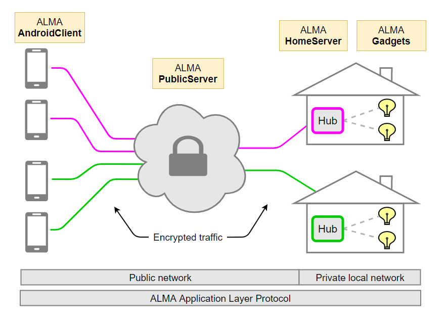

#  ALMA Home Automation
## Concept
A modular home automation system, including software for:
* [Android client](https://github.com/AntonGrn/home-auto-ALMA-v2.0/tree/master/android-client#androidclient): Remote control and real-time monitoring of home server gadgets.  
* [Public server](https://github.com/AntonGrn/home-auto-ALMA-v2.0#publicserver-remotely-accessible): Connects remote Android clients to associated home servers (hubs).
* [Home server](https://github.com/AntonGrn/home-auto-ALMA-v2.0/tree/master/home-server#homeserver): Hub for gadget management within a home network. 
* [Gadgets](https://github.com/AntonGrn/home-auto-ALMA-v2.0#gadgets): Native ALMA software or supported "off-the-shelf" smart home devices.
* [Automations](https://github.com/AntonGrn/home-auto-ALMA-v2.0#automations): Trigger actions based on local time, timers or states of gadgets.

## ALMA Application Layer Protocol
* Communication [protocol](https://github.com/AntonGrn/home-auto-ALMA/blob/master/public-server/images/communication-protocol.pdf) for the ALMA nodes (AndroidClients, PublicServer, HomeServer, ALMA gadgets).

## Encryption
* [AndroidClients](https://github.com/AntonGrn/home-auto-ALMA-v2.0/tree/master/android-client#androidclient) :left_right_arrow: [PublicServer](https://github.com/AntonGrn/home-auto-ALMA-v2.0#publicserver-remotely-accessible) :left_right_arrow: [HomeServers](https://github.com/AntonGrn/home-auto-ALMA-v2.0/tree/master/home-server#homeserver)
  * Data transmission: Public network.
  * Symmetric encrypition (AES with CBC) and message authentication (MAC).
  * Unique secret keys are distributed using asymmetric encryption (RSA) at the initialization of each TCP session.
* [HomeServer](https://github.com/AntonGrn/home-auto-ALMA-v2.0/tree/master/home-server#homeserver) :left_right_arrow: [Gadgets](https://github.com/AntonGrn/home-auto-ALMA-v2.0#gadgets)
  * Data transmission: Private network (LAN).
  * *Native ALMA gadgets*: XOR encryption with iterating keys.
  * *TP-Link smart plugs*: XOR encryption with Autokey (keystream) cipher.
  * *RF 433 MHz modules*: No encryption.

# Software Components



## AndroidClient
* Android application for remote control and monitoring of gadget states.
* Connects to [PublicServer](https://github.com/AntonGrn/home-auto-ALMA-v2.0#publicserver-remotely-accessible) (for remote access to a [HomeServer](https://github.com/AntonGrn/home-auto-ALMA-v2.0/tree/master/home-server#homeserver) instance).
* Notified when any changes to a gadget state is detected or successfully requested.
* See also: Android [design and communications](https://github.com/AntonGrn/home-auto-ALMA-v2.0/tree/master/android-client#androidclient).

## PublicServer (remotely accessible)
* Service running on public network (e.g. as daemon on a VPS).
* Connects [AndroidClients](https://github.com/AntonGrn/home-auto-ALMA-v2.0/tree/master/android-client#androidclient) to [HomeServers](https://github.com/AntonGrn/home-auto-ALMA-v2.0/tree/master/home-server#homeserver) (hubs).
* Verifies user authentication to (strictly) map AndroidClients to correct HomeServer (hub).
* Eliminates the need of port-forwarding HomeServers.
* Client management using thread pool for asynchronous client connections and communications.
* MySQL:
  * Client authentication data.
  * Map AndroidClients to correct HomeServer instance.
  * Log client traffic (for tracking invalid server access attempts).
* `config.json`
  * Setup-file for PublicServer.
  
Example of `config.json`
```yaml
{
  "public_server": {
    "tcp_port": 8084,
    "thread_pool": 10,
    "debug_mode": false
  },
  "database_clients": {
    "ip": "localhost",
    "port": 3306,
    "database": "XXXXXX",
    "account": "XXXXXX",
    "password": "XXXXXX"
  },
  "database_traffic_logs": {
    "ip": "localhost",
    "port": 3306,
    "database": "XXXXXX",
    "account": "XXXXXX",
    "password": "XXXXXX"
  }
}
```
See also: [ALMA web admin tool](https://github.com/AntonGrn/home-auto-ALMA-v2.0/tree/master/public-server#alma-web-admin-tool).

## HomeServer (local hub)
* The key component of the home automation system.
* Service running inside LAN (e.g. as daemon on a Raspberry Pi).
* Connects to [PublicServer](https://github.com/AntonGrn/home-auto-ALMA-v2.0#publicserver-remotely-accessible) (via user authentication).
* Handles:
  * Gadget initialization and communication.
  * Periodically polling gadget states and connectivity.
  * Reporting changes in gadget states and connectivity to AndroidClients (via PublicServer).
  * Processing and executing requests from AndroidClients (e.g. alter a gadget state).
  * Scanning automation triggers and executing automation actions.
* `config.json`
  * Setup-file for HomeServer.

Example of `config.json`:
```yaml
{
  "debug_mode": false,
  "public_server_connection": true,
  "hub_alias": "My House",
  "hub_ID": 107,
  "hub_password": "XXXXXXXXXX",
  "public_server_IP": "XXX.XXX.XXX.XXX",
  "public_server_port": 8084
}
```
See also: [Get started](https://github.com/AntonGrn/home-auto-ALMA-v2.0/tree/master/home-server#homeserver) with HomeServer.

## Gadgets
* Managed by [HomeServer](https://github.com/AntonGrn/home-auto-ALMA-v2.0/tree/master/home-server#homeserver).
* Polled at intervals set uniquelly for each gadget.
* Fast response on request to alter gadget state.
* `gadgets.json`
  * Setup-file for all gadgets in the HomeServer system. 
  * Used for adequate communication with, and representation of, each gadget.
  * For easy (non-hard-coded) gadget introduction and management.
  * **Note:** HomeServer must be restarted for changes in `gadgets.json`to take effect.

Example of `gadgets.json`:
```yaml
{
  "alma": [
    {
      "gadget_id": 1,
      "alias": "My Lamp",
      "type": "CONTROL_ONOFF",
      "poll_delay_seconds": 30,
      "enabled": true,
      "IP_address": "192.168.0.12",
      "TCP_port": 8082,
      "request_spec": null
    },
    {
      "gadget_id": 2,
      "alias": "Temperature (C)",
      "type": "SENSOR_VALUE",
      "poll_delay_seconds": 60,
      "enabled": true,
      "IP_address": "192.168.0.13",
      "TCP_port": 8082,
      "request_spec": "temperature"
    }
  ],
  "tp_link": [],
  "rf433MHz": [],
  "plugins": []
}
```
See extended [example](https://github.com/AntonGrn/home-auto-ALMA-v2.0/tree/master/home-server#get-started-with-gadgets-and-automations) of `gadgets.json`.

### Supported gadget architectures
Each gadget architecture conforms to a property in `gadgets.json` for easy configuration:

* `alma`
  * Native ALMA gadgets: Obeys to the ALMA Application Layer Protocol for communication.
  * Easily modular to represent resources ranging from hardware devices (e.g. via [ESP8266](https://www.espressif.com/en/products/socs/esp8266/overview)) to software states (e.g. CPU temperature) and web scraping data.
  * Gadget communication via TCP Sockets.
* `tp_link`
  * TP-Link smart plugs ([HS100](https://www.tp-link.com/se/home-networking/smart-plug/hs100/) & [HS110](https://www.tp-link.com/se/home-networking/smart-plug/hs110/))
  * Gadget communication via TCP Sockets.
* `rf433Mz`
  * 433MHz receiver devices.
  * Gadget communication via [rpi-rf](https://pypi.org/project/rpi-rf/).
* `plugins`
  * Specific purpose gadgets being run internally by HomeServer.
  * Plugin gadgets include Raspberry Pi GPIO control and Raspberry Pi CPU temperature monitor.

**Note:** All gadget configurations and introductions are done in `gadgets.json`.

### Supported gadget types
* Each gadget must be configured (`gadgets.json`) to be of one of the supported gadget types.
* The predefined gadget types ensures adequate control and representation of each gadget.
```java
public enum GadgetType {CONTROL_ONOFF, CONTROL_VALUE, SENSOR_ONOFF, SENSOR_VALUE}
```
* *CONTROL_ONOFF*
  * Interactive.
  * Remotely controlled on/off gadgets (toggle).
  * E.g. Lamp.
* *CONTROL_VALUE*
  * Interactive.
  * Remotely controlled integer value gadgets.
  * E.g. Temperature threshold.
* *SENSOR_ONOFF*
  * Not interactive.
  * Remotely monitor on/off state of sensor gadget.
  * E.g. Window is closed.
* *SENSOR_VALUE*
  * Not interactive.
  * Remotely monitor integer state of sensor gadget.
  * E.g. Temperature sensor.
  
## Automations
* Managed by [HomeServer](https://github.com/AntonGrn/home-auto-ALMA-v2.0/tree/master/home-server#homeserver).
* Trigger actions based on local time, timers or states of gadgets.
* `automations.json`
  * Setup-file for all automations in the HomeServer system. 
  * Simple creation and management of gadget automations.
  * **Note:** HomeServer must be restarted for changes in `automations.json`to take effect.
  
Example of one automation in `automations.json`:
```yaml
{
  "name": "My coffee timer",
  "enabled": true,
  "trigger":
  {
    "type": "event",
    "gadget_id": 7,
    "state_condition": "equal_to",
    "state": 1
  },
  "timer":
  {
    "hours": 0,
    "minutes": 30,
    "seconds": 0
  },
  "action": [
    {
      "gadget_id": 7,
      "state": 0
    }
  ]
}
```
See extended [example](https://github.com/AntonGrn/home-auto-ALMA-v2.0/tree/master/home-server#example-of-automationsjson) of `automations.json`.

### Automation-trigger
* Specifies the condition required to trigger automation actions.
* Two trigger types: `event` and `time`.

**Trigger type: `event`**
  * Trigger the automation actions based on the state of a specified gadget in the system.
  * `state_condition`: Must be one of the following: `equal_to`, `greater_than`, `less_than`, `greater_or_equal_to`, `less_or_equal_to`.
```yaml
"trigger":
{
  "type": "event",
  "gadget_id": 7,
  "state_condition": "equal_to",
  "state": 1
}
```
**Trigger type: `time`**
  * Trigger the automation actions based on current local time.
  * Required format: *HH:mm*. 
```yaml
"trigger":
{
  "type": "time",
  "time": "17:00"
}
```

### Automation-timer
* Optional delay between the trigger returning true and the action being executed.
```yaml
"timer":
{
  "hours": 0,
  "minutes": 0,
  "seconds": 0
}
```

### Automation-action
* Specifes the actions to be executed when the trigger condition returns true.
* The list structure allows a single automation to affect multiple target gadgets.
```yaml
"action": [
  {
    "gadget_id": 11,
    "state": 1
  },
  {
    "gadget_id": 8,
    "state": 35
  },  
]
```

## Notable repository content

**Overall**
- :page_facing_up: [ALMA basic conceptual figure](https://github.com/AntonGrn/home-auto-ALMA-v2.0/blob/master/public-server/images/alma-concept.png)
- :page_facing_up: [ALMA data communications figure](https://github.com/AntonGrn/home-auto-ALMA-v2.0/blob/master/android-client/images/concept_2.png)
- :page_facing_up: [ALMA application layer protocol](https://github.com/AntonGrn/home-auto-ALMA-v2.0/blob/master/public-server/images/communication-protocol.pdf)

**Home Server (hub)**
- :page_facing_up: [Get started](https://github.com/AntonGrn/home-auto-ALMA-v2.0/tree/master/home-server#homeserver) *(Home Server setup)*
- :page_facing_up: Example: [*gadgets.json*](https://github.com/AntonGrn/home-auto-ALMA-v2.0/tree/master/home-server#get-started-with-gadgets-and-automations)
- :page_facing_up: Example: [*automations.json*](https://github.com/AntonGrn/home-auto-ALMA-v2.0/tree/master/home-server#example-of-automationsjson)
- :file_folder: [Home Server Application](https://github.com/AntonGrn/home-auto-ALMA-v2.0/tree/master/home-server/home-server-application/deployable-setup) *(Deployable)*
- :file_folder: [Home Server Application](https://github.com/AntonGrn/home-auto-ALMA-v2.0/tree/master/home-server/home-server-application/java-project/HomeServer/src/main) *(Java)*
  - :page_facing_up: Cryptography scheme
  - :file_folder: [Automations](https://github.com/AntonGrn/home-auto-ALMA-v2.0/tree/master/home-server/home-server-application/java-project/HomeServer/src/main/automations)
  - :file_folder: [Gadgets](https://github.com/AntonGrn/home-auto-ALMA-v2.0/tree/master/home-server/home-server-application/java-project/HomeServer/src/main/gadgets)
      - :page_facing_up: Native ALMA
      - :page_facing_up: TP-Link switches (HS100 & HS110)
      - :page_facing_up: RF 433 MHz 
      - :file_folder: Plugins
        - :page_facing_up: Local Pi CPU temp 
        - :page_facing_up: Local Pi GPIO
- :file_folder: [JSON files](https://github.com/AntonGrn/home-auto-ALMA-v2.0/tree/master/home-server/json)
  - :page_facing_up: automations.json *(template)*
  - :page_facing_up: config.json *(template)*
  - :page_facing_up: gadgets.json *(template)*
- :file_folder: [Native ALMA gadget examples](https://github.com/AntonGrn/home-auto-ALMA-v2.0/tree/master/home-server/gadget-examples)
  - :page_facing_up: ESP8266 CONTROL_ONOFF
  - :page_facing_up: ESP8266 CONTROL_VALUE
  - :page_facing_up: ESP8266 SENSOR_VALUE 
  - :page_facing_up: Remote Pi CPU temp SENSOR_VALUE
- :file_folder: [Python scripts](https://github.com/AntonGrn/home-auto-ALMA-v2.0/tree/master/home-server/python-scripts)
  - :page_facing_up: Pi GPIO
  
**Android Client**
- :page_facing_up: [Android design and communications](https://github.com/AntonGrn/home-auto-ALMA-v2.0/tree/master/android-client#androidclient)
- :file_folder: [Android Client Application](https://github.com/AntonGrn/home-auto-ALMA-v2.0/tree/master/android-client/AndroidClient/app/src/main/java/com/example/androidclient) (Java)

**Public Server**
- :file_folder: [Public Server Application](https://github.com/AntonGrn/home-auto-ALMA-v2.0/tree/master/public-server/PublicServer/src/main) (Java)

**Related resources**
- :page_facing_up: [ALMA web admin tool](https://github.com/AntonGrn/home-auto-ALMA-v2.0/tree/master/public-server#alma-web-admin-tool)

## Updates
* **2020-06-17:** Support for TP-Link smart plugs HS100 & HS110.
* **2020-06-22:** HomeServer periodically poll gadget states rather than maintaining persistant Socket connections to every gadget. This makes it a more light weight system, with less nested threading and simplifies adding support for other gadget architectures (e.g. off-the-shelf devices). 
* **2020-06-26:** Debug mode for PublicServer and HomeServer. Fatal exceptions are always logged. However, with `"debug_mode":true` in `config.json`, the nodes additionally log all messages being sent or received as part of ordinary operations. This is helpful for debugging node communications.
* **2020-06-29:** Property `request_spec: String/null` for native ALMA gadgets in `gadgets.json` (HomeServer). By specifying the data requested from a gadget; multiple gadget services can be provided from one gadget unit. E.g. one gadget unit may provide both temperature and humidity data.
* **2020-06-29:** Support for 433MHz receiver switches.
* **2020-07-06:** Automations: Create and manage gadget automations in `automations.json` (HomeServer).
