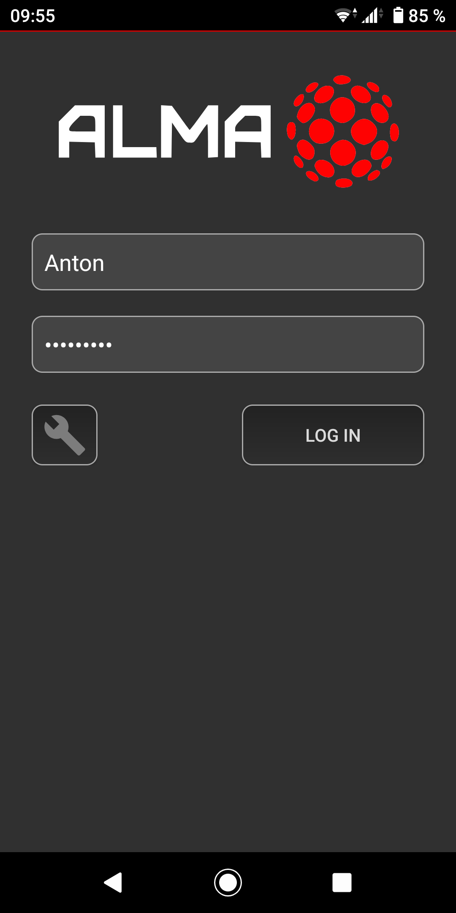

# AndroidClient
The AndroidClient application connects to an ALMA PublicServer for remote access to a HomeServer instance. When logging in using your AndroidClient, your user credentials are used by the PublicServer for mapping to an associated HomeServer instance.


**Figure 1**: Android represenation of HomeServer gadgets.

## Logging in
### 1. Specify Server
The first time you log in using the AndroidClient, you must specify the *IP-address* and *port number* of the dedicated ALMA PublicServer (Figure 2). This information is saved to the phone's cache memory upon successful login, and need therefor only be entered once. It is however possible to edit the server specifics at any time.


**Figure 2**: Specify ALMA PublicServer

### 2. Manual and Automatic login
**Manual login:** Once a server has been selected, you can manually enter your user credentials (Figure 3). These are used by the PublicServer for mapping to a specific HomeServer instance. 



**Figure 3**: Manual login

**Automatic login:** Upon successful manual login, the PublicServer returns a unique hash-generated *session key*. The key is stored on your phone's cache memory and will be used for *automatic login* henceforth. This means that the next time you open the app you need not enter any login credentials. Instead an automatic login attempt will be carried out with no user interaction required. The session key is erased from the  phone's memory when clicking the *Log out* button. After this is done; manual login is again required.

## Data communication
When the AndroidClient is mapped to a HomeServer, the HomeServer will update the connected AndroidClient to display those of its gadgets from ```gadgets.json```that are enabled and confirmed to be present (accessible) in the home network. The AndroidClient is notified by the HomeServer (via the PublicServer) whenever a change in a gadget state is detected, and whenever a request to alter a gadget state has been successfully executed. A conceptual figure of the communication between AndroidClient, PublicServer and HomeServer can be found below (Figure X).

## Note reguarding security
The purpose of the session key mentioned above is to provide convenient, fast and secure automatic login without the use of your secret password. This means your password is never stored locally on the phone, and is only transmitted once upon manual login.

All traffic between your phone, the PublicServer and your HomeServer is encrypted. The session key has nothing to do with the encryption, and your information (user name, password, session key, gadget data) is never sent in plain text. The unique encryption keys used for each new TCP session protects not only the confidentiality of the data being sent (the readability of the data), but also protects against replay attacks (attempts by any attacker to achieve any usable effect by capturing the encrypted data during its tranfer and sending it to the server again).

