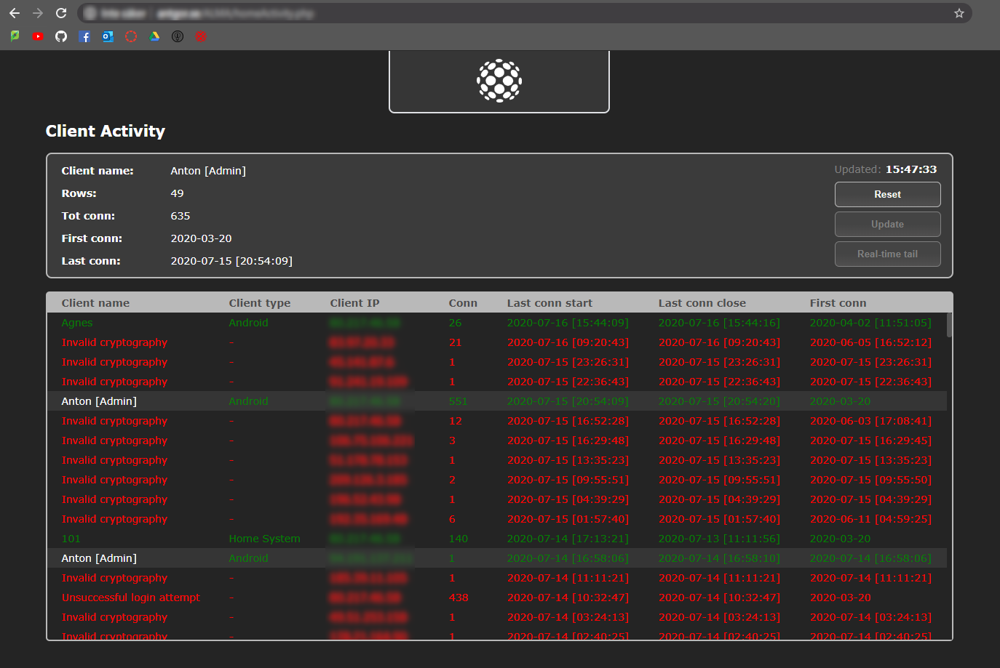

# PublicServer

ALMA PublicServer is a service running on a public network. Its purpose is to connect remote AndroidClients to HomeServer instances, without the need to port-forward HomeServers and by providing necessary security for the communicaiton. 

See [main page](LINK) for more information about the PublicServer.

## Database tables
Listed below are the database tables required to run ALMA PublicServer.

Table: `Client_Android`
| Column name | Data type | Note |
| --- | --- | --- |
| name | String | PRIM.KEY |
| systemID | Integer | - |
| admin | Boolean | - |
| password | String | - |
| sessionKey | String | - |
| banned | Boolean | - |

Table: `Client_HomeServer`
| Column name | Data type | Note |
| --- | --- | --- |
| systemID | Integer | PRIM.KEY |
| password | String | - |
| banned | Boolean | - |

Table: `Client_Traffic`
| Column name | Data type | Note |
| --- | --- | --- |
| clientName | String| PRIM.KEY |
| clientType| String | - |
| clientIP | String | PRIM.KEY |
| nbrOfConns | Integer | - |
| lastConnStart | DateTime | - |
| lastConnClose | DateTime | - |
| firstConn | DateTime | - |

## ALMA web admin tool
* Admin tool to track the traffic on the ALMA PublicServer.
  * Detect suspiscious traffic.
  * Survey the load of the server.
* Based on database table `Client_Traffic`.
  * Logging both successful and unsuccesful login attempts.
  * Links repeated server visitors.

